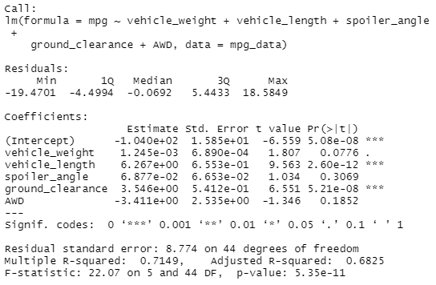

# MechaCar Statistical Analysis

## Linear Regression to Predict MPG

Both vehicle length and ground clearance provide a non-random amound of variance to the mpg variable. It is possible that vehicle weight is also a significant variable. It's p-value of .08 lies between .05 and .1. The slope of our model would definitely be non-zero. Since we have multiple variables which provide some statistical covariance to mpg we consider the slop to be non-zero. 
The output does not indicate to me that our model predicts mpg with much accuracy. One indication of this is the fact that our R squared value is only .68. Although R-Squared is not the best indicator of fit, this tells us that our model is only able predict about 68% of the variation in mpg.

## Summary Statistics on Suspension Coils

The requirement to not exceed 100 variance in PSI holds for the MechaCars. However, if we break down by lot we find that lots 1 and 2 have really low variance, but the cars from lot 3 have variance above 170 and do not comply with this design specification.

## T-Tests on Suspension Coils

A t-test on the total cars results in a p-value of .06, an almost significant result at the .05 level of significance. More interestingly, if we analyze the lots seperately we find that only lot 3 has a significant difference with a p-value of .04.

## Study Design: MechaCar vs Competition

Consumers care most about the lifetime value of cars. Brands like Toyota are known for how well their cars last and how repairable they are. We would like to study statistically how MechaCar holds up to the competition. We are going to calculate the lifetime cost (extrapolated to 10 years) of a MechaCar and comppare that to an average Toyota. We will add the cost of a new MechaCar with all repair costs incurred in the first 10 years of ownership. We collect this data from MechaCar drivers and compare the results with published results from Toyota. Our null hypothesis is that the lifetime cost of a MechaCar is the same as a Toyota and have an alternative hypothesis that it is less.
We will use a one-sided t-test to determine the results in addition to the data collected from our consumers.